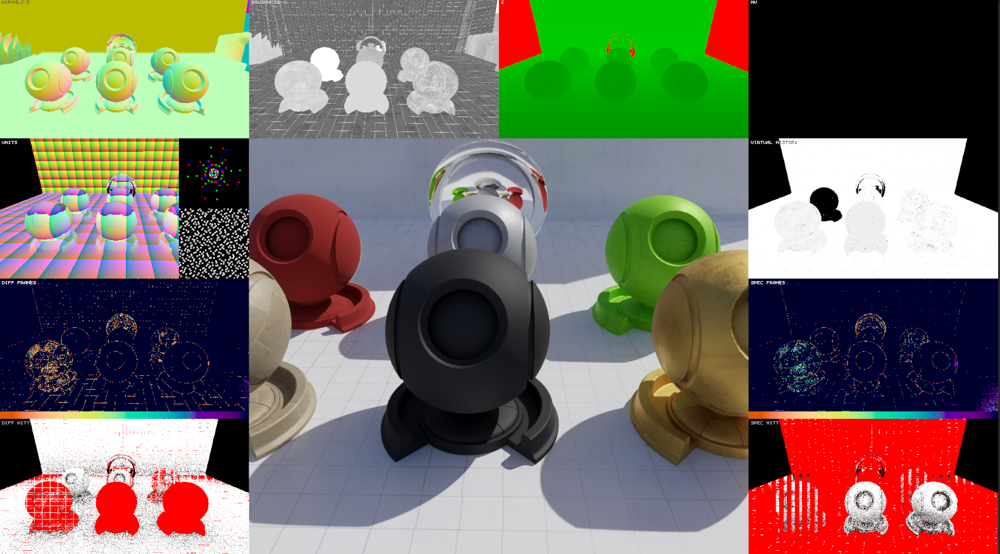
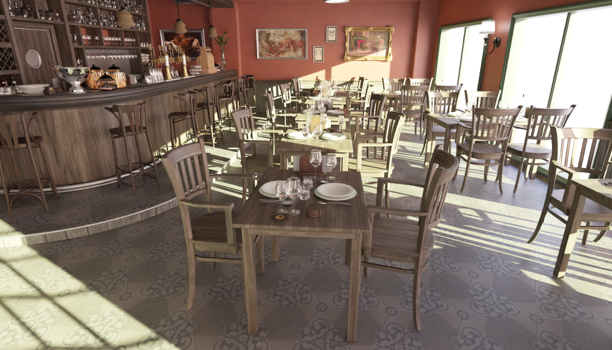
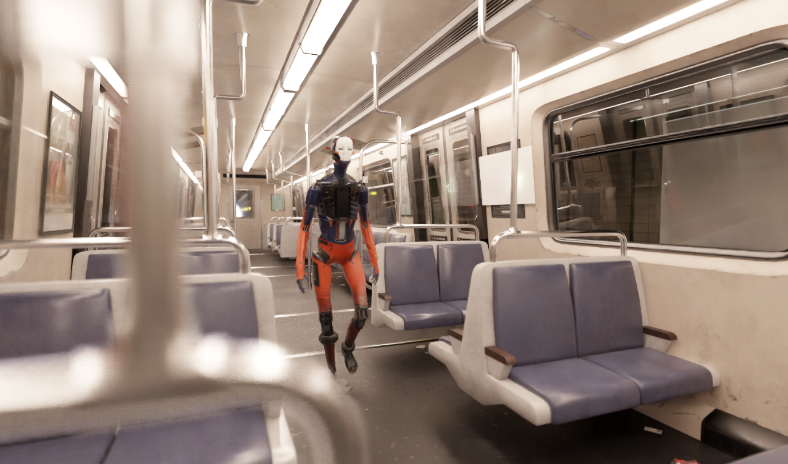
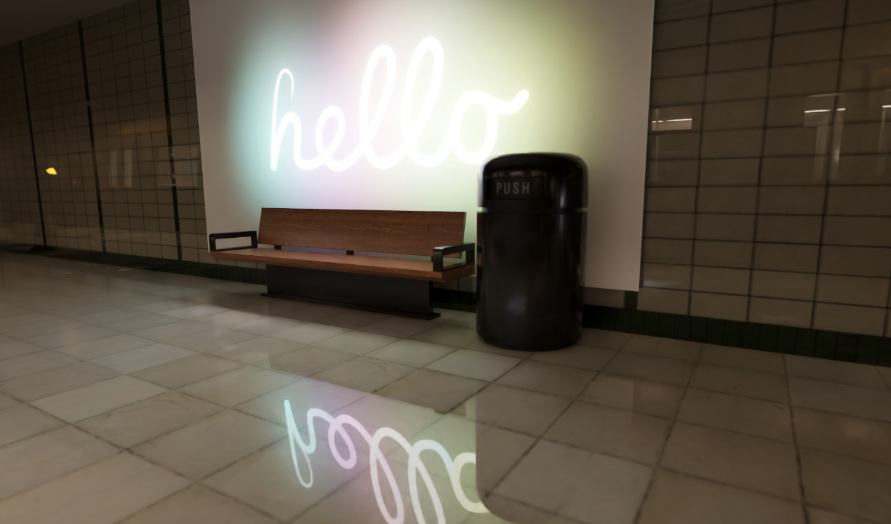
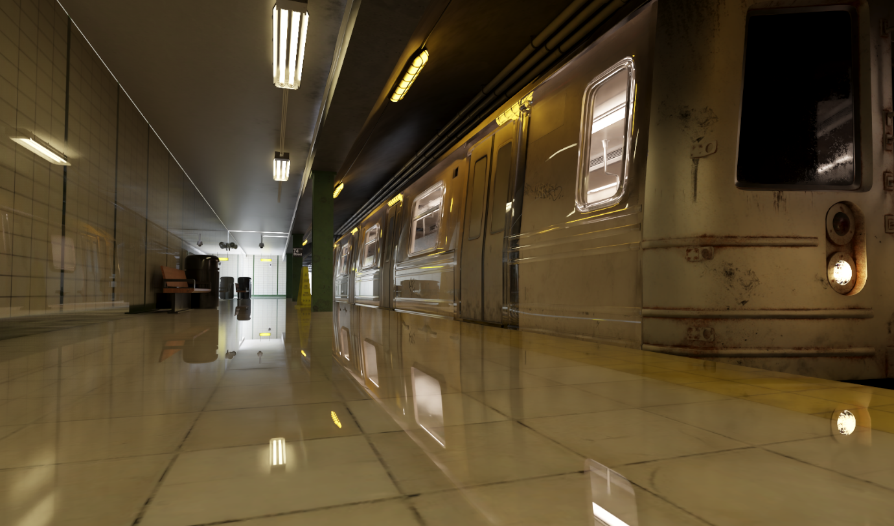

# UnityPathTracing

[English](#english) | [中文](#中文)

---

<a name="english"></a>

A real-time path tracing rendering system built in Unity URP, replicating the core features of NVIDIA NRDSample, RTXDI, and other RTX technologies, with optimizations and extensions for the Unity environment. Primarily serves as an experimental playground for various RTX-related technologies in Unity.

At its core, a native rendering plugin based on shader reflection information is implemented, enabling arbitrary shaders to be compiled with arbitrary parameters and used within Unity. This makes it possible to leverage various DX12 features — including custom acceleration structures, SER, OMM, and Bindless — directly in Unity.

Four RenderFeatures are currently implemented: native and Unity versions of NrdSampleFeature, and native and Unity versions of RtxdiFeature. The native NrdSampleFeature has been highly optimized to work with Unity's multi-threaded rendering, achieving performance nearly identical to the original NRD-Sample.

Blog post: [NRDSample Implementation in Unity](https://www.kuanmi.top/2026/01/22/UnityNRD)

Blog post: [RTXDI Implementation in Unity](https://www.kuanmi.top/2026/04/14/UnityRtxdi/)

---

## Features

- [x] **Path Tracing**: DXR-based path tracing pipeline
- [x] **SHARC**: Spatial Hash Radiance Cache
- [x] **NRD Denoising**: NVIDIA NRD integrated via native C++ plugin, supporting REBLUR and SIGMA
- [x] **DLSS Ray Reconstruction**: DLSS RR integrated via native plugin for upscaling and ray reconstruction
- [x] **ReSTIR DI/GI**: Compute shader version matches the original in performance but cannot handle alpha clipping. Ray tracing version supports alpha clipping but incurs a 4ms performance cost.
- [x] **Textured Emissive Light Sampling**: Enables bindless-based emissive light gathering with texture support by passing textures to the native plugin.
- [x] **Multiple Light Types**: Point lights, spot lights, and area lights
- [x] **Dynamic Scenes**: Skinned mesh animation and dynamic objects
- [x] **Primary Surface Replacement**: High-quality specular reflection via PSR
- [x] **VR Support**: Path tracing in VR mode
- [x] **TMP Support**: World-space TextMeshPro rendering support
- [x] **Auto Exposure**: Histogram-based auto exposure
- [x] **Subsurface Scattering**: RTXCR integrated, supports transmission (direct light)
- [ ] **Volumetric Lighting**: Planned

---

## How to Run

```bash
git clone https://github.com/Kuan-Mi/UnityPathTracing
cd UnityPathTracing
build_and_copy.bat
download_bistro.bat
```

### Upgrade Unity's built-in Agility SDK to 1.619.1

The Unity editor ships with an older Agility SDK. You need to upgrade it to version 1.619.1 by patching the editor executable and replacing the D3D12 runtime DLLs.

You can do this manually by hex-editing the Unity executable (change the SDK version constant from `618` to `619`) and then downloading `D3D12Core.dll` and `d3d12SDKLayers.dll` from the [Microsoft.Direct3D.D3D12 NuGet package](https://www.nuget.org/packages/Microsoft.Direct3D.D3D12) and replacing the files in the `D3D12/` folder next to the Unity executable.

Alternatively, use the provided PowerShell script **`patch.ps1`**, which automates both steps:

1. Opens a file picker — select your `Unity.exe` (e.g. `C:\Program Files\Unity\Hub\Editor\6000.3.2f1\Editor\Unity.exe`)
2. Patches the SDK version constant in the binary in-place
3. Downloads Agility SDK 1.619.1 from NuGet and overwrites `D3D12Core.dll` / `d3d12SDKLayers.dll` in the adjacent `D3D12\` folder
4. Backs up all modified files as `.bak` before overwriting

```powershell
powershell -ExecutionPolicy Bypass -File patch.ps1
```

> **Note:** Run PowerShell as Administrator if UAC prevents writing to `Program Files`.

> **Note:** The built game executable also needs to be patched. Run `patch.ps1` again and select the `.exe` in your build output folder. The `D3D12\` folder will be created automatically next to it.

---

## Requirements

- **GPU**: NVIDIA RTX GPU with DXR support (RTX 3060 or above recommended)
- **Unity Version**: 6000.3.2. Versions 6000.3.4 and above currently have a bug in Frame Debugger that causes crashes.

---

## Acknowledgements

Thanks to [inedelcu](https://github.com/INedelcu) for the great help with writing ray tracing shaders and handling acceleration structures.

## References
[NRD-Sample](https://github.com/NVIDIA-RTX/NRD-Sample)

[RTXGI](https://github.com/NVIDIA-RTX/RTXGI)

[RTXDI](https://github.com/NVIDIA-RTX/RTXDI)

---

<a name="中文"></a>

在 Unity URP 中实现的实时路径追踪渲染系统，复刻了 NVIDIA NRDSample、RTXDI等核心功能，并针对 Unity 环境进行了优化和扩展。主要是试验各种RTX相关技术在Unity中的使用。

其中实现了一个基于Shader反射信息的原生渲染插件，可以以任意参数编译任意着色器并在Untiy中使用，这使得自定义加速结构、SER、OMM、Bindless等各种dx12特性可以在Unity中使用。

目前实现了四个RenderFeature，分别是原生/untiy版本的NrdSampleFeature，原生/Unity版本的RtxdiFeature。

其中原生版本的NrdSampleFeature经过高度优化，可以适配unity的多线程渲染，性能和原版（NrdSample）几乎一致

详见博客：[NRDSample 在 Unity 中的实现](https://www.kuanmi.top/2026/01/22/UnityNRD)

详见博客：[RTXDI 在 Unity 中的实现](https://www.kuanmi.top/2026/04/14/UnityRtxdi/)

---

## 功能特性

- [x] **路径追踪**：基于 DXR 的路径追踪管线
- [x] **SHARC**：空间哈希辐射缓存
- [x] **NRD 降噪**：通过原生 C++ 插件集成 NVIDIA NRD，支持 REBLUR 和 SIGMA
- [x] **DLSS Ray Reconstruction**：通过原生插件集成 DLSS RR，实现超分辨率和重建功能
- [x] **ReSTIR DI/GI**：计算着色器版本和原版性能一致，但无法处理透明度裁切。光追版本可以处理透明度裁切，但性能差了4ms。
- [x] **纹理灯光收集**：通过将纹理传至NativePlugin，实现了基于Bindless的自发光带纹理的灯光收集。
- [x] **多种光源支持**：点光源、聚光灯、区域光源支持
- [x] **动态场景**：支持动态物体和蒙皮动画
- [x] **主表面替换**：通过主表面替换实现高质量的镜面反射
- [x] **VR 支持**：支持 VR 模式下的路径追踪渲染
- [x] **TMP 支持**：世界空间下的 TextMeshPro 文本渲染支持
- [x] **自动曝光**：基于直方图的自动曝光
- [x] **次表面散射**：集成 RTXCR，支持透射（直接光）
- [ ] **体积光**：待实现

---

## 如何运行

```bash
git clone https://github.com/Kuan-Mi/UnityPathTracing
cd UnityPathTracing
build_and_copy.bat
download_bistro.bat
```

### 将 Unity 内置的 Agility SDK 升级至 1.619.1

Unity 编辑器自带的 Agility SDK 版本较旧，需要升级至 1.619.1。

你可以手动完成此操作：用十六进制编辑器修改 Unity 可执行文件中的版本常量（将 `618` 改为 `619`），然后从 [Microsoft.Direct3D.D3D12 NuGet 包](https://www.nuget.org/packages/Microsoft.Direct3D.D3D12) 下载 `D3D12Core.dll` 和 `d3d12SDKLayers.dll`，并替换 Unity 可执行文件同级目录下 `D3D12\` 文件夹中的对应文件。

也可以使用项目提供的 PowerShell 脚本 **`patch.ps1`**，它会自动完成以上所有步骤：

1. 弹出文件选择框，选择你的 `Unity.exe`（例如 `C:\Program Files\Unity\Hub\Editor\6000.3.2f1\Editor\Unity.exe`）
2. 自动修改可执行文件中的 SDK 版本常量
3. 从 NuGet 下载 Agility SDK 1.619.1，并覆盖同级 `D3D12\` 目录中的 DLL 文件
4. 所有被修改的文件在覆盖前均会备份为 `.bak`

```powershell
powershell -ExecutionPolicy Bypass -File patch.ps1
```

> **注意**：如果 UAC 阻止写入 `Program Files` 目录，请以管理员身份运行 PowerShell。

> **注意**：打包后的游戏可执行文件同样需要修改。再次运行 `patch.ps1`，选择打包输出目录中的 `.exe` 文件即可，`D3D12\` 文件夹会自动创建在其同级目录下。

---

## 要求

- **GPU**：支持 DXR 的 NVIDIA RTX 显卡（如 RTX 3060 及以上）
- **Untiy版本**: 6000.3.2 6000.3.4以上版本FrameDebug目前有Bug，会闪退。

---


## 致谢

感谢 [inedelcu](https://github.com/INedelcu) 的帮助，在编写光追着色器和处理加速结构方面帮了我很多。

## 参考
[NRD-Sample](https://github.com/NVIDIA-RTX/NRD-Sample)

[RTXGI](https://github.com/NVIDIA-RTX/RTXGI)

[RTXDI](https://github.com/NVIDIA-RTX/RTXDI)

---






