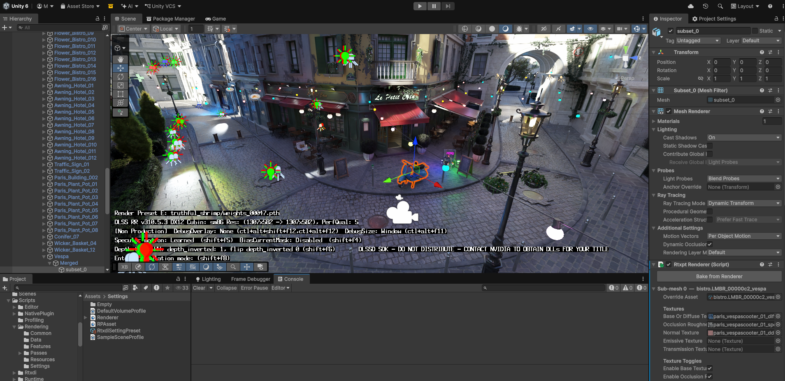
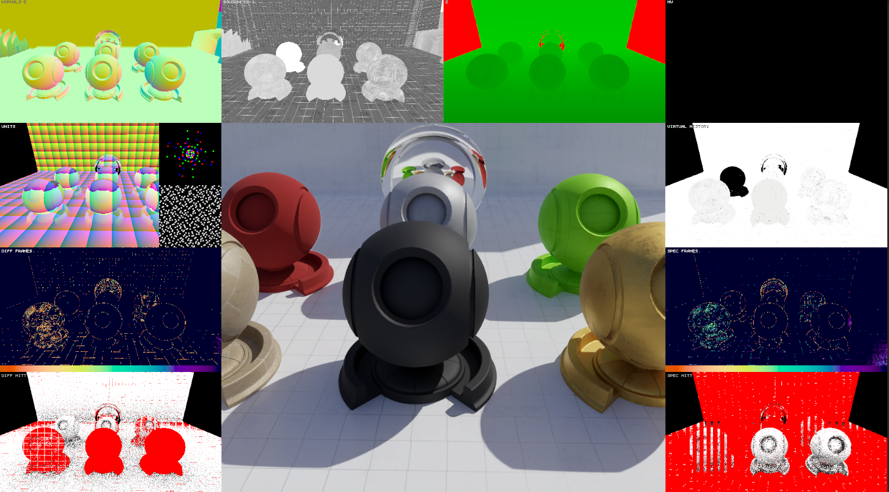
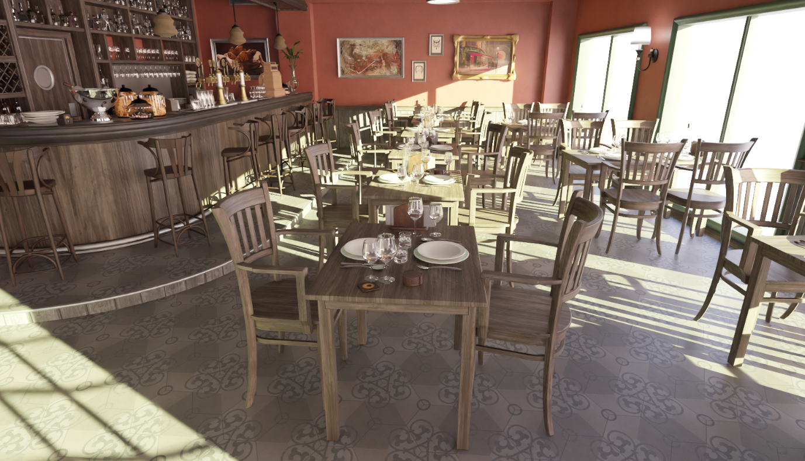
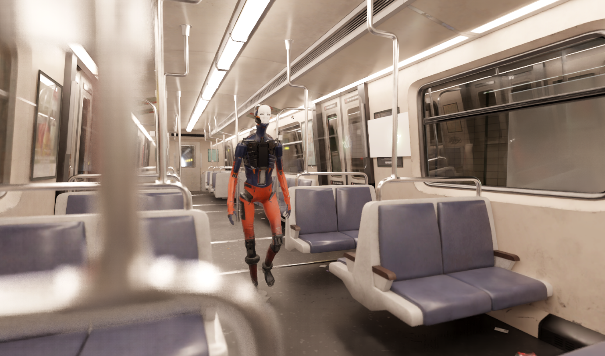
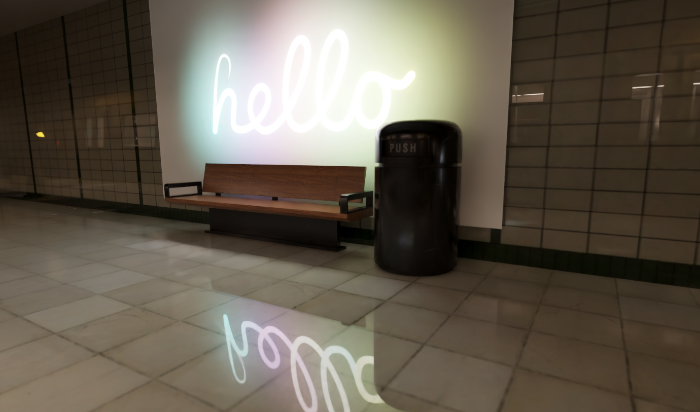
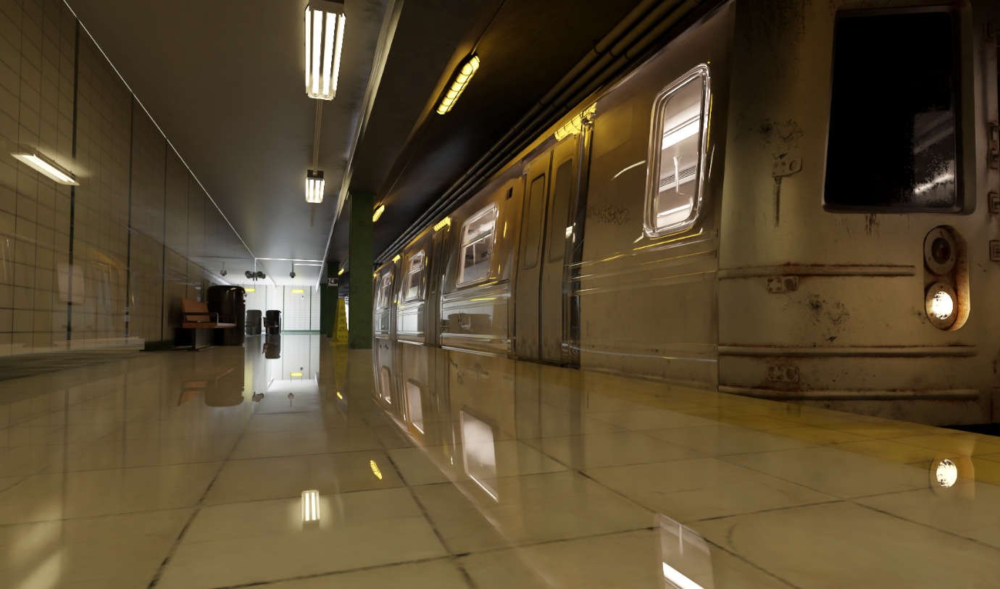

# UnityPathTracing




[English](#english) | [中文](#中文)

---

<a name="english"></a>

A real-time path tracing rendering system built in Unity URP, replicating the core features of NVIDIA NRDSample, RTXDI, RTXPT, and other RTX technologies, with optimizations and extensions for the Unity environment. Primarily serves as an experimental playground for various RTX-related technologies in Unity.

At its core, a native rendering plugin based on shader reflection information is implemented, enabling arbitrary shaders to be compiled with arbitrary parameters and used within Unity. This makes it possible to leverage various DX12 features — including custom acceleration structures, SER, OMM, and Bindless — directly in Unity.

Five RenderFeatures are currently implemented: native and Unity versions of NrdSampleFeature, native and Unity versions of RtxdiFeature, and RtxPt.

The native NrdSampleFeature has been highly optimized to work with Unity's multi-threaded rendering, achieving performance nearly identical to the original NRD-Sample.

The RtxPt version is also nearly identical in performance to the original, with good support for Unity's various analytic lights. However, its performance is lower than NrdSample and it relies more heavily on DLSS RR.

Blog post: [NRDSample Implementation in Unity](https://www.kuanmi.top/2026/01/22/UnityNRD)

Blog post: [RTXDI Implementation in Unity](https://www.kuanmi.top/2026/04/14/UnityRtxdi/)

---

## How to Run

```bash
git clone https://github.com/Kuan-Mi/UnityPathTracing
cd UnityPathTracing
build_and_copy.bat
python tools\restore_rtxpt_assets.py
python tools\restore_nrdsample_assets.py
```

### Upgrade Unity's built-in Agility SDK to 1.619.1

The Unity editor ships with an older Agility SDK. You need to upgrade it to version 1.619.1 by patching the editor executable and replacing the D3D12 runtime DLLs.

You can do this manually by hex-editing the Unity executable (change the SDK version constant from `618` to `619`) and then downloading `D3D12Core.dll` and `d3d12SDKLayers.dll` from the [Microsoft.Direct3D.D3D12 NuGet package](https://www.nuget.org/packages/Microsoft.Direct3D.D3D12) and replacing the files in the `D3D12/` folder next to the Unity executable.

Alternatively, use the provided PowerShell script **`patch.ps1`**, which automates both steps:

1. Opens a file picker — select your `Unity.exe` (e.g. `C:\Program Files\Unity\Hub\Editor\6000.3.17f1\Editor\Unity.exe`)
2. Patches the SDK version constant in the binary in-place
3. Downloads Agility SDK 1.619.1 from NuGet and overwrites `D3D12Core.dll` / `d3d12SDKLayers.dll` in the adjacent `D3D12\` folder
4. Backs up all modified files as `.bak` before overwriting

```powershell
powershell -ExecutionPolicy Bypass -File patch.ps1
```

> **Note:** Run PowerShell as Administrator if UAC prevents writing to `Program Files`.

> **Note:** The built game executable also needs to be patched. Run `patch.ps1` again and select the `.exe` in your build output folder. The `D3D12\` folder will be created automatically next to it.

---

## Requirements

- **GPU**: NVIDIA RTX GPU with DXR support (RTX 3060 or above recommended)
- **Unity Version**: 6000.3.17

---

## Acknowledgements

Thanks to [inedelcu](https://github.com/INedelcu) for the great help with writing ray tracing shaders and handling acceleration structures.

## References
[NRD-Sample](https://github.com/NVIDIA-RTX/NRD-Sample)

[RTXGI](https://github.com/NVIDIA-RTX/RTXGI)

[RTXDI](https://github.com/NVIDIA-RTX/RTXDI)

[RTXPT](https://github.com/NVIDIA-RTX/RTXPT)

---

<a name="中文"></a>

在 Unity URP 中实现的实时路径追踪渲染系统，复刻了 NVIDIA NRDSample、RTXDI、RTXPT等核心功能，并针对 Unity 环境进行了优化和扩展。主要是试验各种RTX相关技术在Unity中的使用。

其中实现了一个基于Shader反射信息的原生渲染插件，可以以任意参数编译任意着色器并在Untiy中使用，这使得自定义加速结构、SER、OMM、Bindless等各种dx12特性可以在Unity中使用。

目前实现了五个RenderFeature，分别是原生/untiy版本的NrdSampleFeature，原生/Unity版本的RtxdiFeature，以及RtxPt。

其中原生版本的NrdSampleFeature经过高度优化，可以适配unity的多线程渲染，性能和原版（NrdSample）几乎一致

Rtxpt版本也几乎和原版性能一致，且对Unity的各种分析光源支持较好，但性能不如NrdSample，比较依赖DLSSRR。

详见博客：[NRDSample 在 Unity 中的实现](https://www.kuanmi.top/2026/01/22/UnityNRD)

详见博客：[RTXDI 在 Unity 中的实现](https://www.kuanmi.top/2026/04/14/UnityRtxdi/)

## 如何运行

```bash
git clone https://github.com/Kuan-Mi/UnityPathTracing
cd UnityPathTracing
build_and_copy.bat
python tools\restore_rtxpt_assets.py
python tools\restore_nrdsample_assets.py
```

### 将 Unity 内置的 Agility SDK 升级至 1.619.1

Unity 编辑器自带的 Agility SDK 版本较旧，需要升级至 1.619.1。

你可以手动完成此操作：用十六进制编辑器修改 Unity 可执行文件中的版本常量（将 `618` 改为 `619`），然后从 [Microsoft.Direct3D.D3D12 NuGet 包](https://www.nuget.org/packages/Microsoft.Direct3D.D3D12) 下载 `D3D12Core.dll` 和 `d3d12SDKLayers.dll`，并替换 Unity 可执行文件同级目录下 `D3D12\` 文件夹中的对应文件。

也可以使用项目提供的 PowerShell 脚本 **`patch.ps1`**，它会自动完成以上所有步骤：

1. 弹出文件选择框，选择你的 `Unity.exe`（例如 `C:\Program Files\Unity\Hub\Editor\6000.3.17f1\Editor\Unity.exe`）
2. 自动修改可执行文件中的 SDK 版本常量
3. 从 NuGet 下载 Agility SDK 1.619.1，并覆盖同级 `D3D12\` 目录中的 DLL 文件
4. 所有被修改的文件在覆盖前均会备份为 `.bak`

```powershell
powershell -ExecutionPolicy Bypass -File patch.ps1
```

> **注意**：如果 UAC 阻止写入 `Program Files` 目录，请以管理员身份运行 PowerShell。

> **注意**：打包后的游戏可执行文件同样需要修改。再次运行 `patch.ps1`，选择打包输出目录中的 `.exe` 文件即可，`D3D12\` 文件夹会自动创建在其同级目录下。

---

## 要求

- **GPU**：支持 DXR 的 NVIDIA RTX 显卡（如 RTX 3060 及以上）
- **Untiy版本**: 6000.3.17

---


## 致谢

感谢 [inedelcu](https://github.com/INedelcu) 的帮助，在编写光追着色器和处理加速结构方面帮了我很多。

## 参考
[NRD-Sample](https://github.com/NVIDIA-RTX/NRD-Sample)

[RTXGI](https://github.com/NVIDIA-RTX/RTXGI)

[RTXDI](https://github.com/NVIDIA-RTX/RTXDI)

[RTXPT](https://github.com/NVIDIA-RTX/RTXPT)

---






